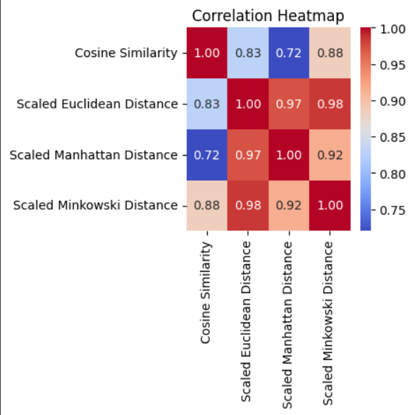
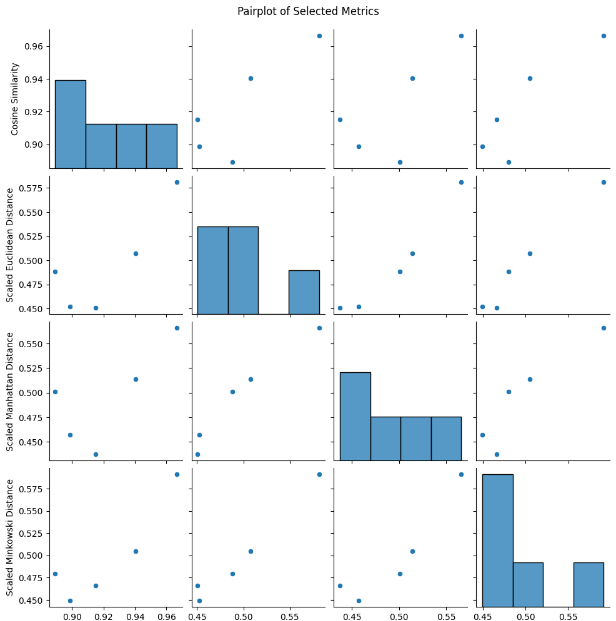
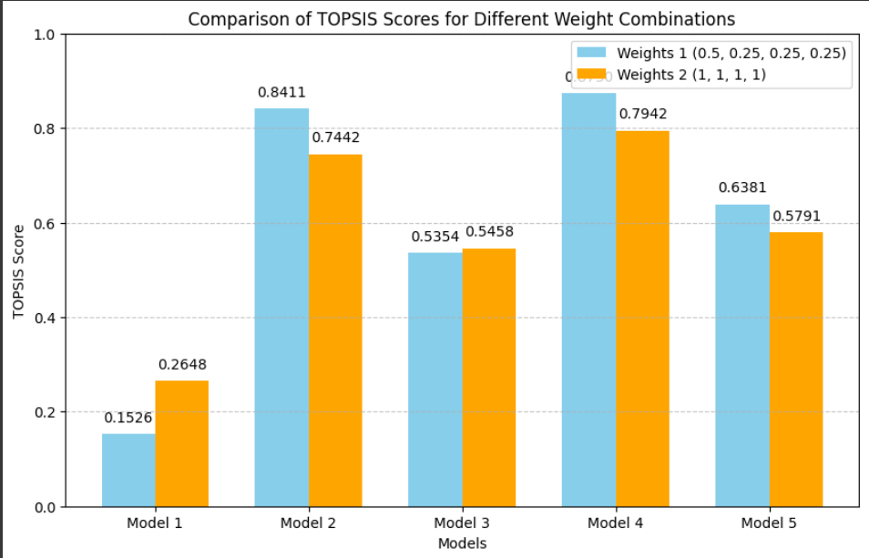

# Sentence Similarity Analysis
This project focuses on evaluating sentence similarity using state-of-the-art Sentence Transformer models. The goal is to assess and compare the performance of various models in capturing semantic similarity between a given query and a set of passages. The analysis includes computing similarity scores, normalizing distances, and applying TOPSIS analysis to rank models based on different criteria.

## Dependencies
- sentence_transformers
- Topsis-Himanshu-102103568
- pandas
- matplotlib
- seaborn
- numpy

## TOPSIS Analysis
The TOPSIS (Technique for Order of Preference by Similarity to Ideal Solution) analysis in this project is applied to evaluate and rank different Sentence Transformer models based on their performance metrics. The project includes examples of TOPSIS analysis with different weight configurations to showcase its flexibility in decision support for selecting the most appropriate Sentence Transformer model for a given task.

## Evaluation Metrics
In this project, we employ various evaluation metrics to assess the performance of Sentence Transformer models in capturing sentence similarity. The key metrics used are:

1. **Cosine Similarity:**
Measures the cosine of the angle between the query and passage embeddings.
A higher cosine similarity indicates greater similarity between sentences.

2. **Euclidean Distance:**
Represents the Euclidean norm (L2 norm) between the query and passage embeddings.
Lower values signify closer proximity and higher similarity.

3. **Manhattan Distance:**
Measures the Manhattan norm (L1 norm) between the query and passage embeddings.
Provides a robust metric for similarity evaluation.

4. **Minkowski Distance:**
A generalization of both Euclidean and Manhattan distances, where the parameter 'p' influences the norm.
Allows flexibility in evaluating similarity based on different norms.
These metrics are computed for each Sentence Transformer model and are further normalized to ensure consistency and comparability across different scales. The normalized values are then used in TOPSIS analysis to rank the models based on their overall performance, considering specified weights and impacts for each metric.

## Results and Analysis

Model evaluation done for the case: 
- **Query:** "That is a happy person"
- **Passages:**
  1. "That is a happy dog"
  2. "That is a very happy person"
  3. "Today is a sunny day"

### Models Used
We employed several pre-trained Sentence Transformer models to conduct the evaluation:

- Model 1: "Sakil/sentence_similarity_semantic_search"
- Model 2: "sentence-transformers/all-mpnet-base-v2"
- Model 3: "sentence-transformers/multi-qa-MiniLM-L6-cos-v1"
- Model 4: "sentence-transformers/distiluse-base-multilingual-cased-v2"
- Model 5: "sentence-transformers/all-MiniLM-L6-v2"

### Results for different weights
1. **Result for weights = 0.5, 0.25, 0.25, 0.25**
  
  | Model | Cosine Similarity | Scaled Euclidean Distance | Scaled Manhattan Distance | Scaled Minkowski Distance | TOPSIS Score | Rank |
  |-------|--------------------|---------------------------|---------------------------|---------------------------|--------------|------|
  | M1    | 0.9664             | 0.5814                    | 0.5658                    | 0.5914                    | 0.1526       | 5.0  |
  | M2    | 0.8988             | 0.4523                    | 0.4572                    | 0.4496                    | 0.8411       | 2.0  |
  | M3    | 0.9404             | 0.5075                    | 0.5138                    | 0.5050                    | 0.5354       | 4.0  |
  | M4    | 0.9151             | 0.4507                    | 0.4375                    | 0.4663                    | 0.8730       | 1.0  |
  | M5    | 0.8893             | 0.4882                    | 0.5011                    | 0.4798                    | 0.6381       | 3.0  |

2. **Result for weights = 1,1,1,1**
  
  | Model | Cosine Similarity | Scaled Euclidean Distance | Scaled Manhattan Distance | Scaled Minkowski Distance | TOPSIS Score | Rank |
  |-------|--------------------|---------------------------|---------------------------|---------------------------|--------------|------|
  | M1    | 0.9664             | 0.5814                    | 0.5658                    | 0.5914                    | 0.2648       | 5.0  |
  | M2    | 0.8988             | 0.4523                    | 0.4572                    | 0.4496                    | 0.7442       | 2.0  |
  | M3    | 0.9404             | 0.5075                    | 0.5138                    | 0.5050                    | 0.5458       | 4.0  |
  | M4    | 0.9151             | 0.4507                    | 0.4375                    | 0.4663                    | 0.7942       | 1.0  |
  | M5    | 0.8893             | 0.4882                    | 0.5011                    | 0.4798                    | 0.5791       | 3.0  |

# Conclusion

